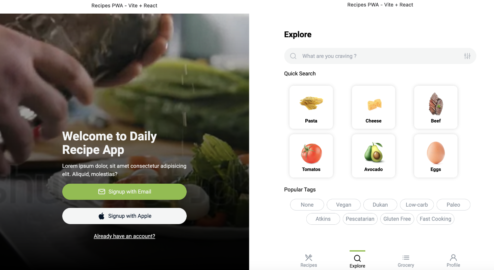

### PWA + ReactJS
A food recipe PWA with ReactJS. The app uses vite to package the files and Tailwind for the styles.

### 🎨 Design
Inspired by [Behance](https://www.behance.net/gallery/102048063/Daily-Recipe-Mobile-App-Interaction-Cooking?tracking_souAdjunto)

### ⚡️ Development
```
npm run dev
```

### ⚒️ Build
```
npm run build
```

### 📦 Deployment
This project is hosted on GitHub Pages.
```
npm run deploy
```